# Gethin's Custom BATTLE ROBOT
**This is my custom Robot Wars inspired battle robot with a servo-driven axe weapon, wireless radio frequency remote control, LCD display, RGB lights, and audio sound effects. My robot is controlled by a custom PCB RF remote using a Raspberry Pi Pico 2 WH microcontroller running CircuitPython and the chassis and axe will be 3D printed in PLA.**

I am going to create it using a Raspberry pi pico 2 WH, TT motors, L298N motor drivers, and a servo motor. It will be controlled by a 433mhz radio frequency remote, another Raspberry pi pico 2 WH, a joystick module and extra control buttons. The 2 main axe weapons and chassis will be 3d printed in PLA.

I will also use a 1.8" SPI LCD Display for the robot to display information on the front of the robot and SK6812 MINI-E RGB leds for the back of the robot. These will both be powered by being plugged into the breadboard in the robot using the pins and jumper wires.

Also I will have sound effects for my robot. I will do this through a PAM8302 amplifier board and 8Ω 2W speaker. The amplifier board will go into the breadboard & the speaker will plug directly into the PAM8302.

It will be powered by AA batteries, the actual robot will be connected using a breadboard & jumper wires, but I want to create a custom PCB for my remote. I will design the PCB in KiCad, also with female sockets so I can remove modules from the remote.

**Note:** I will need to connect the grounds on either side together so they have the same voltage reference point.

My weapon system consists of a servo motor embedded on the underside of the top half of the chassis that will swing the PLA axe weapon down to hit, and back up to rest on the slanted design of the robot.

---

## Inspiration
I wanted to make this project to help me learn CAD design through Fusion 360, PCB design in KiCad and get me into the world of electronics and embedded systems.
I designed my robot with inspiration from Thor in Robot Wars with the axe weapon idea and Apollo with the general shape and aesthetics

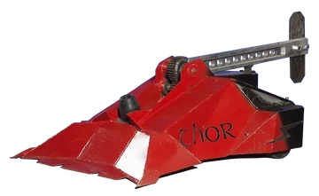
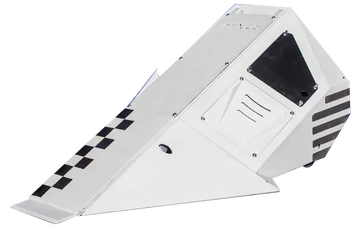

---

## Control

I will control my robot through the use of the PCB remote which will be in a PLA remote case. There will be a joystick module that with the use of the RF transmitter, will control the TT motors on the robot and therefore the movement of the wheels. 

I will also add a button on the remote to control the servo motor that moves the PLA axe weapon and I will also add a few buttons that will likely carry out pre-programmed movement plans, display different info on the robot's screen and play sound effects through the speakers.

---

## **Remote PCB:**

**Solder:**
- Battery wires to copper pad
- Pico through hole
- Buttons

**Headers:**
- RF module
- Joystick
- Boost converter

Remote PCB design:

**This was my first PCB design before I made it in KiCad**

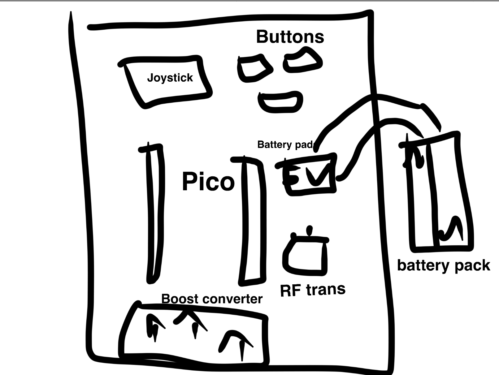

I then designed my remote PCB in KiCad with first the schematic showing how all the components are connected

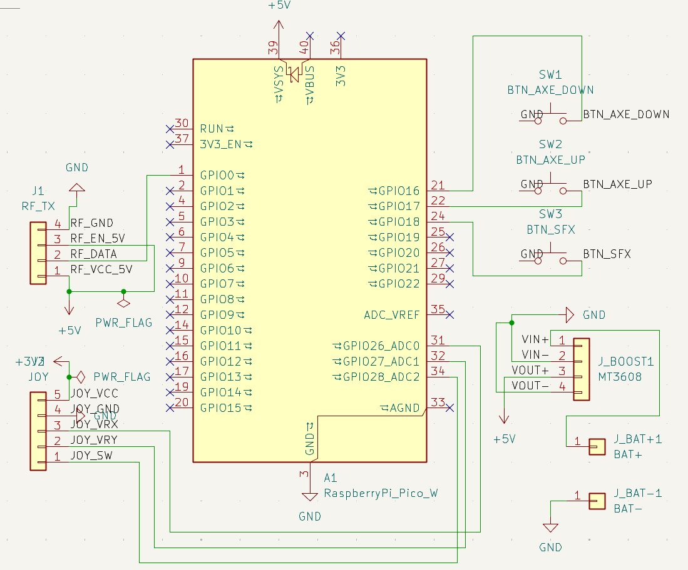

And then I run the ERC checker and moved on to the PCB design where I routed the modules, confirmed final placements and learnt how to make a GND pour on the back face to remove noise.

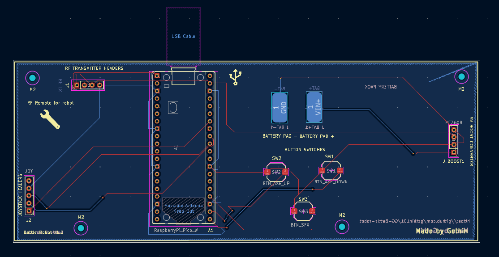

---

## Cart Screenshots

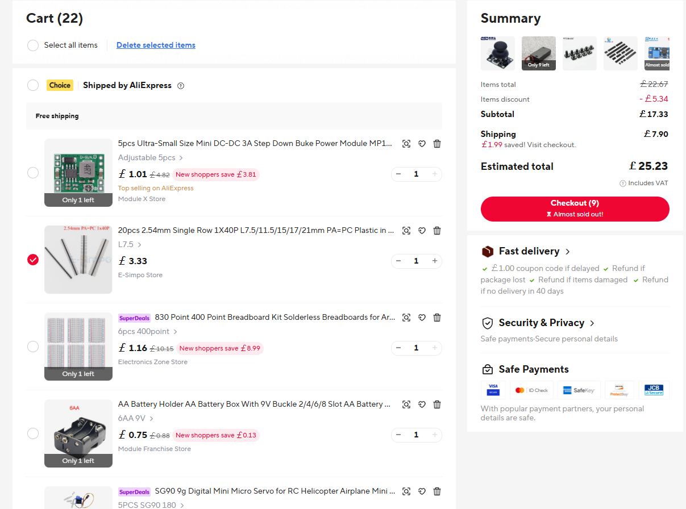

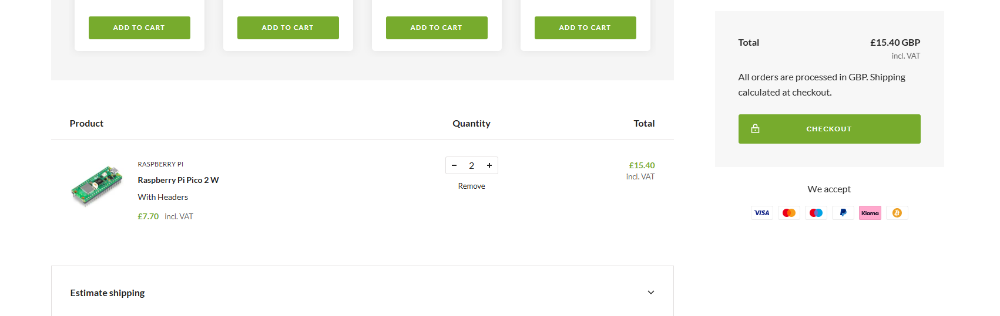
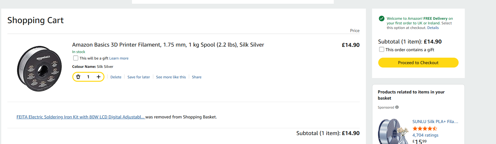
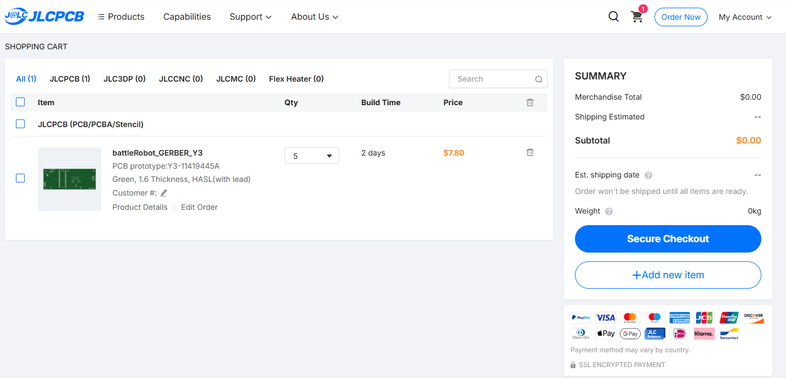

---

## Components

Here are the lists of components for my robot. I have also made a [full BOM](Components/Bill-Of-Materials.md)
with links to all the parts.

**List of components for remote:**

- Raspberry pi pico 2 WH
- Joystick module
- 433 MHz transmitter
- 2xAA Battery pack
- Custom PCB for joystick, transmitter, microcontroller, battery input & boost converter
- A few buttons for display, audio & specific movement plans
- Female sockets for component removal
- 5V boost converter

**List of components for robot:**

- Raspberry pi pico 2WH
- 1.8" SPI LCD Display
- SK6812 MINI-E RGBs
- PAM8302 amplifier board
- 8Ω 2W speaker
- 433 MHz receiver
- 2x L298N motor drivers
- 4x TT motors (raw voltage from L298Ns)
- Servo motor
- 6xAA battery pack
- Breadboard
- Jumper wires for wiring
- PLA axe
- 3D printed chassis
- 5V buck converter
- Magnets for top & bottom chassis connection

**My project should cost around £60 so I reckon it should be Tier 3**

---

---

First 3D fusion model of robot chassis:

I originally designed it like this with 2 axe weapons and patterns but have changed to the version below instead.

This version is the final concept and the files are in **Images/**

Rendered robot with textures applied & motors & wheels components

Showing servo motor setup with axe and TT motors

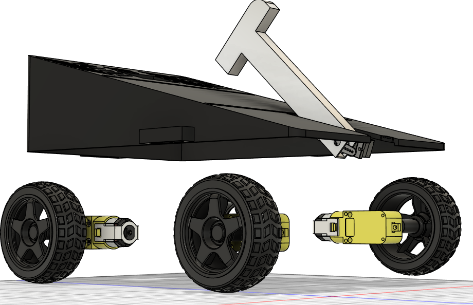

Base bottom of the robot without top half of the chassis

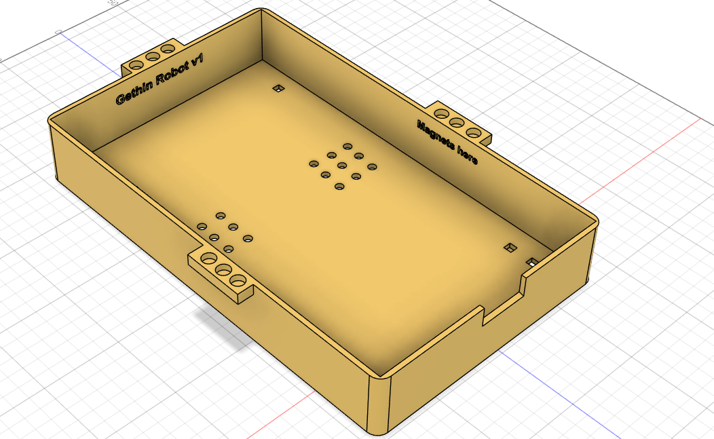

---

**I will make different iterations and designs for the chassis another time but this is my first design for blueprint**

---

## CircuitPython firmware

- I will need to flash a CircuitPython .uf2 onto my picos
- Install circuitpython libraries .mpys
- Upload the different code.pys to my picos
- Test the firmwares are working

## 📝 License
This project is open-source under the MIT License, was designed during the Hackclub Blueprint project in 2025 and was created by [@gethin101](https://github.com/gethin101)

