# Gethin's Custom BATTLE ROBOT
**This is my custom Robot Wars inspired battle robot with a servo-driven axe weapon, wireless radio frequency remote control, LCD display, RGB lights, and audio sound effects. My robot is controlled by a custom PCB RF remote using a Raspberry Pi Pico H microcontroller running CircuitPython and the chassis and axe will be 3D printed in PLA.**

It runs on a Raspberry pi pico H, TT motors, L298N motor drivers, and a servo motor. It is controlled by a 433mhz radio frequency remote, another Raspberry pi pico H, a joystick module and extra control buttons. The 2 main axe weapons and chassis will be 3d printed in PLA.

I am also using a 1.8" SPI LCD Display for the robot to display information on the front of the robot and SK6812 MINI-E RGB leds for the back of the robot. These will both be powered by being plugged into the breadboard in the robot using the pins and jumper wires.

Also I will have sound effects for my robot. I will do this through a PAM8302 amplifier board and 8Ω 2W speaker. The amplifier board will go into the breadboard & the speaker will plug directly into the PAM8302.

**It will be powered by AA batteries, the actual robot will be connected using a breadboard & jumper wires, but I want to create a custom PCB for my remote. I will design the PCB in KiCad, also with female sockets so I can remove modules from the remote.**

**Note:** I will need to connect the grounds on either side together so they have the same voltage reference point.

My weapon system consists of a servo motor embedded on the underside of the top half of the chassis that will swing the PLA axe weapon down to hit, and back up to rest on the slanted design of the robot.

---

## Inspiration
I wanted to make this project to help me learn CAD design through Fusion 360, PCB design in KiCad and get me into the world of electronics and embedded systems.
I designed my robot with inspiration from Thor in Robot Wars with the axe weapon idea and Apollo with the general shape and aesthetics

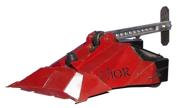
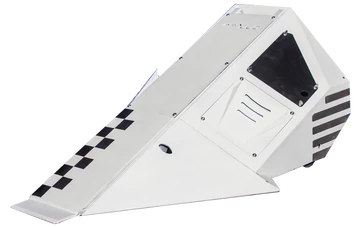

---

## Control

I will control my robot through the use of the PCB remote which will be in a PLA remote case. There will be a joystick module that with the use of the RF transmitter, will control the TT motors on the robot and therefore the movement of the wheels. 

I will also add a button on the remote to control the servo motor that moves the PLA axe weapon and I will also add a few buttons that will likely carry out pre-programmed movement plans, display different info on the robot's screen and play sound effects through the speakers.

---

## **Remote PCB:**

**Solder:**
- Battery wires to copper pad
- Pico through hole
- Buttons

**Headers:**
- RF module
- Joystick
- Boost converter

Remote PCB design:

**This was my first PCB design before I made it in KiCad**

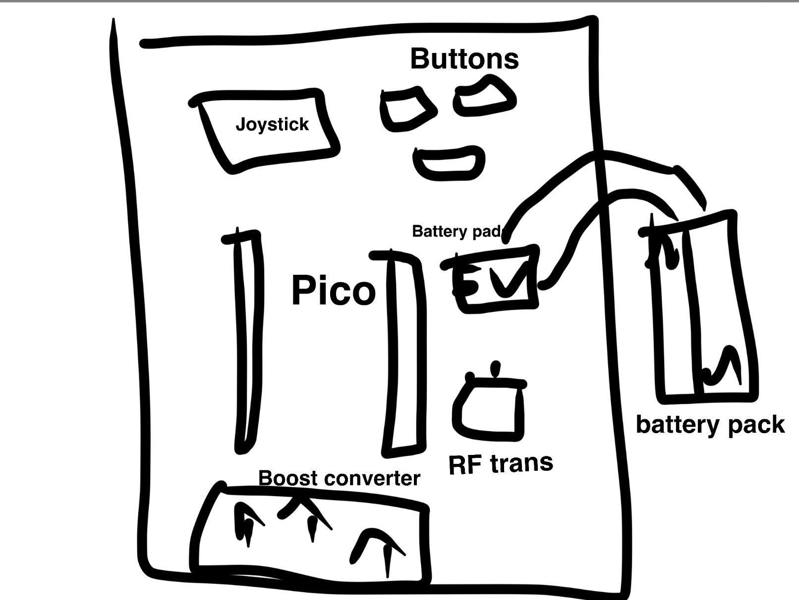

I then designed my remote PCB in KiCad with the schematic below showing how all the components are connected:

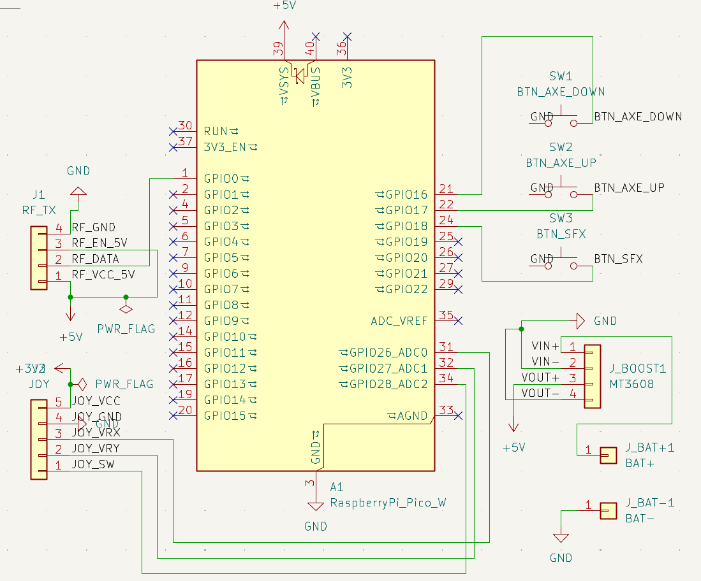

**PCB design process:**

I designed my remote PCB in KiCad. I made through-hole pins for the pico where I will have the choice to either solder on female headers which will allow easy removal of the pico for the remote or to directly solder them on. 
This took some time to design as I wasn't sure on which approach would better fit my project, so I left it for my decision when I get the parts.

Next, I added 3 small buttons that I will solder straight onto the PCB. These will be used as control buttons for the robot where I will program them to sent certains signals to the robot, for example to move the axe head up or down with the servo motor, or to carry out pre-programmed movement plans with the TT motors and wheels.

I added two copper pads for the battery+ and battery- to my PCB to power the remote and I ended up decising to put these on the back side of the PCB so it leaves more space on the front and so I can more easily secure the battery pack on the rear side of the remote, with plently of space to move it around before deciding the final position.

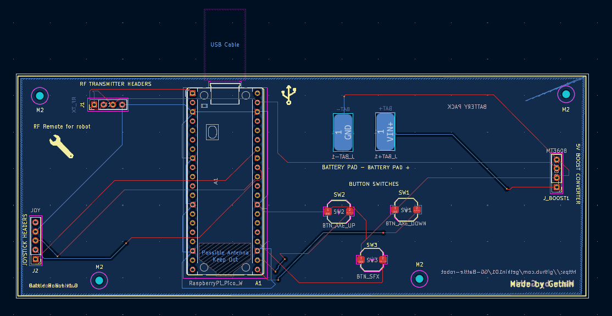

I added holes in my PCB where I will solder on female header pins for the radio frequency transmitter device so it can be easily removed if I come across any issues. I repeated this process on different parts of the remote for the joystick device and 5V boost converter to allow for efficient and easy assembly once I'm ready to build my robot. I first went for through-hole pins in my original design but altered it to have header pins as it will be easier to assemble and tinker with.

Next, I added some silkscreen details onto my PCB such as my name, GitHub repo link and a small mechanical logo. This added a bit more personality to my remote and will allow for it to be easier to distinguish from other robots (ik this is only the remote and will most likely be covered later on, but it was fun to mess about with)

I learnt how to add drill holes on the corners of my PCB so it has the option to be secured into a case and therefore will be more comfortable to use with nothing moving about. Furthermore, I also learnt how to make a copper GND pour which I have found out reduces noise on the PCB and allowed me to have better accessibility to the GND on the remote when I was designing and wiring it in KiCad.

I am happy with my remote PCB and I ran the ERC and DRC checkers a few times, fixed all the issues and now it comes up with no errors when I run them.

The KiCad project files & gerber.zip are both in **PCB/** and the PCB cart screenshot from JLCPCB is below

---

## Cart Screenshots

**Here are the cart screenshots for all of my components. I have logged the prices exactly, but there are some discounts and sales on atm that are ending soon so it may end up costing a bit more.**

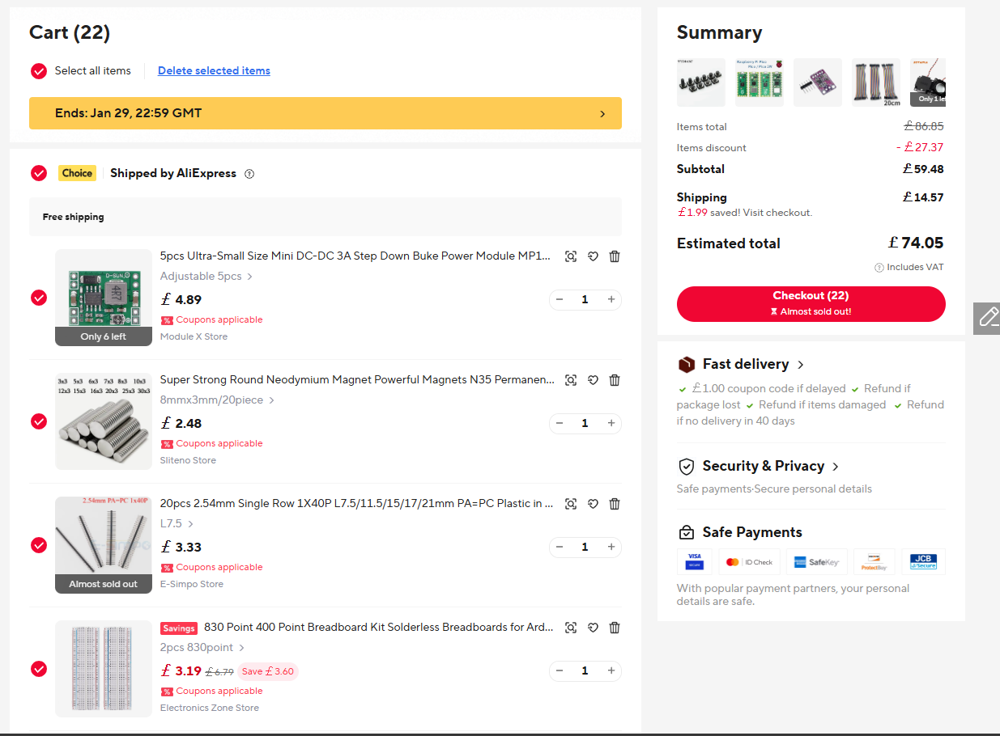

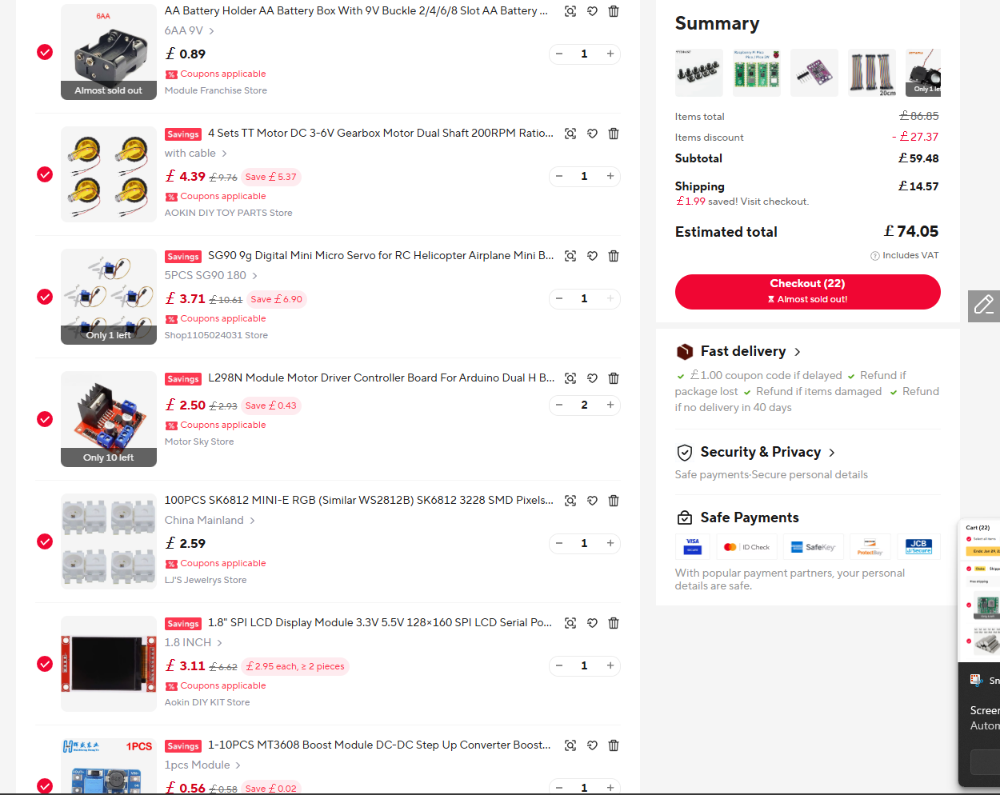

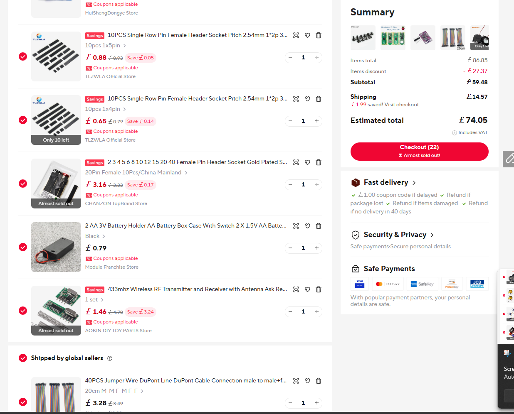

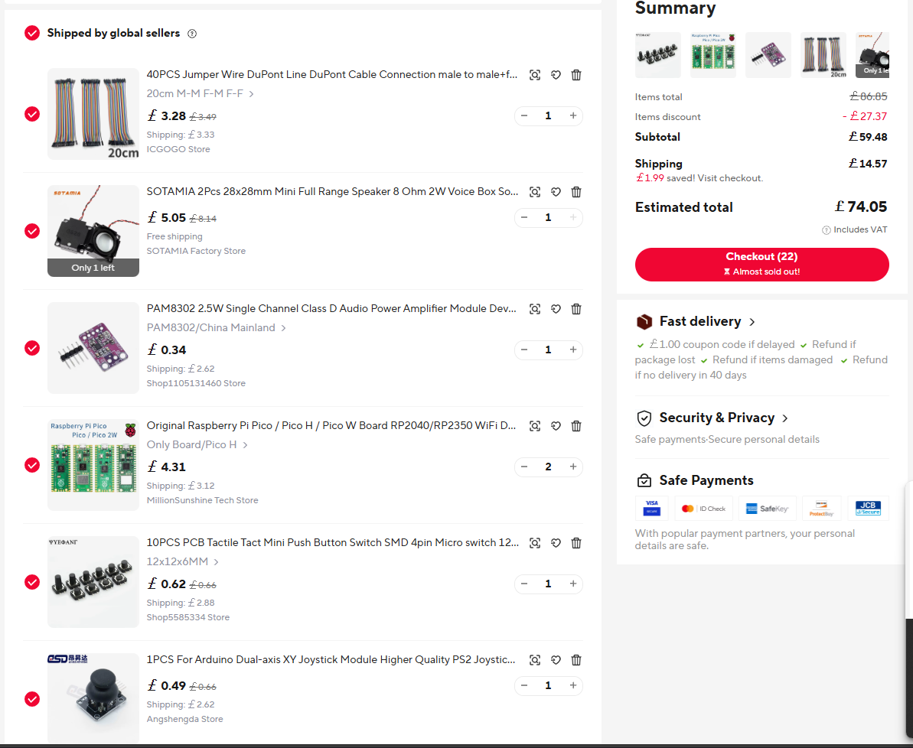

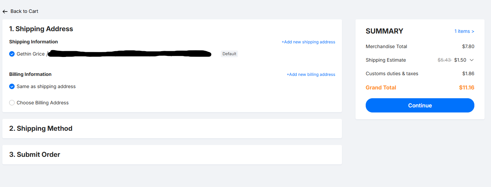

---

## Components

Here are the lists of components for my robot. I have also made a [full BOM](BOM.md)
with links to all the parts.

**List of components for remote:**

- Raspberry pi pico H
- Joystick module
- 433 MHz transmitter
- 2xAA Battery pack
- Custom PCB for joystick, transmitter, microcontroller, battery input & boost converter
- A few buttons for display, audio & specific movement plans
- Female sockets for component removal
- 5V boost converter

**List of components for robot:**

- Raspberry pi pico H
- 1.8" SPI LCD Display
- SK6812 MINI-E RGBs
- PAM8302 amplifier board
- 8Ω 2W speaker
- 433 MHz receiver
- 2x L298N motor drivers
- 4x TT motors (raw voltage from L298Ns)
- Servo motor
- 6xAA battery pack
- Breadboard
- Jumper wires for wiring
- PLA axe
- 3D printed chassis
- 5V buck converter
- Magnets for top & bottom chassis connection

**My project should cost around £80 or $110 so I reckon it should be just Tier 2**

---

---

First 3D fusion model of robot chassis:

I originally designed it like this with 2 axe weapons and patterns but have changed to the version below instead.

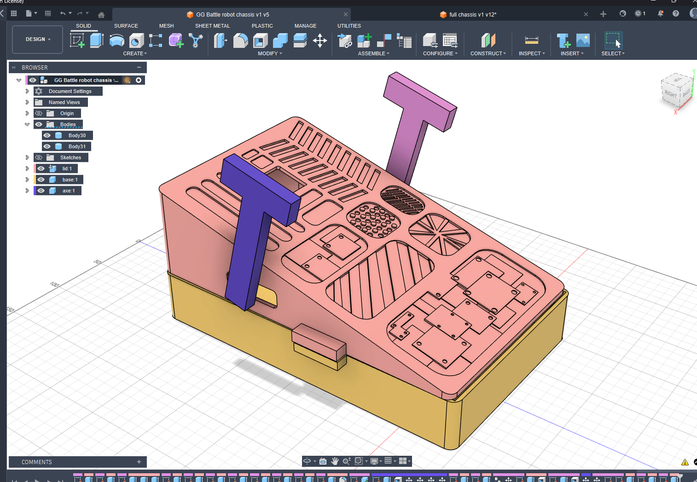

This version is the final concept and the files are in **Images/**

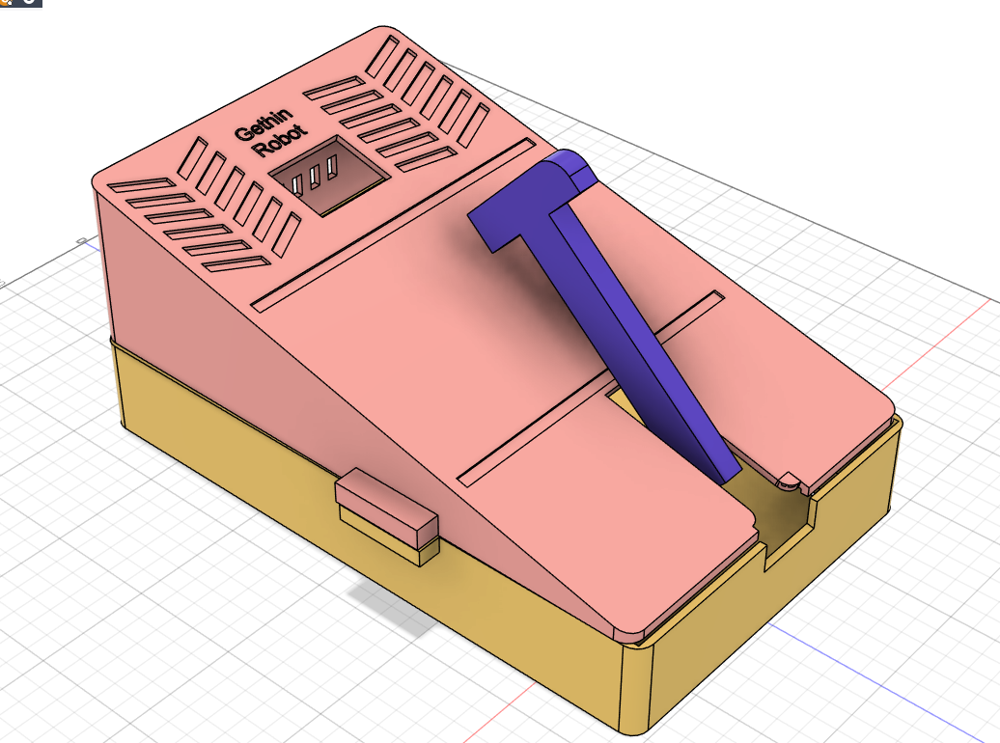

Rendered robot with textures applied & motors & wheels components

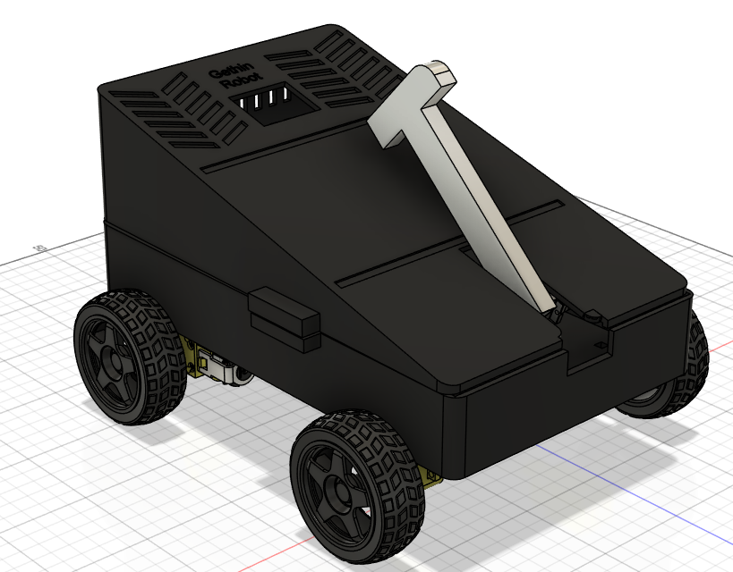

Showing servo motor setup with axe and TT motors

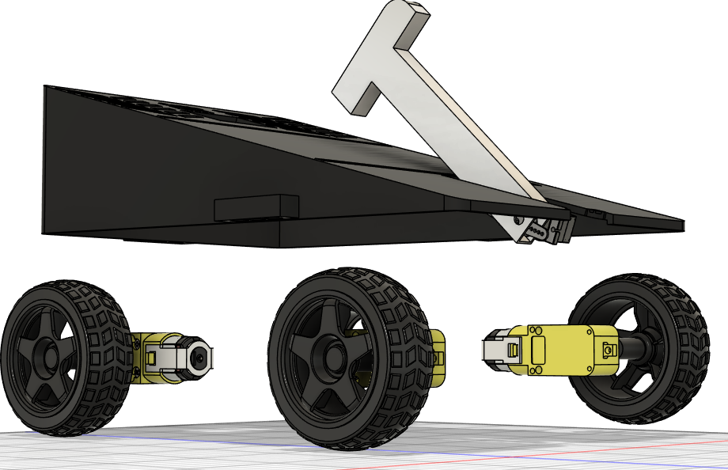

Base bottom of the robot without top half of the chassis

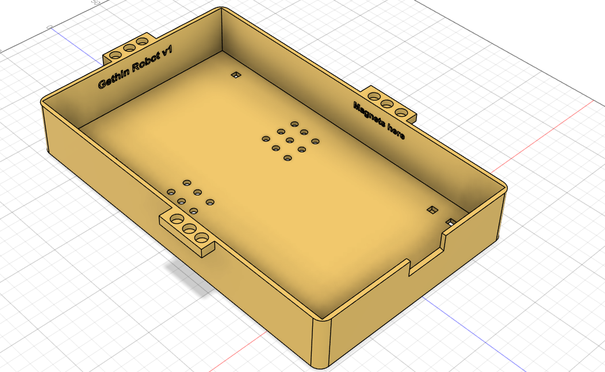

---

**I will make different iterations and designs for the chassis another time but this is my first design for blueprint**

---

## CircuitPython firmware

- I will need to flash a CircuitPython .uf2 onto my picos
- Install circuitpython libraries .mpys
- Upload the different code.pys to my picos
- Test the firmwares are working

## 📝 License
This project is open-source under the MIT License, was designed during the Hackclub Blueprint project in 2025 and was created by [@gethin101](https://github.com/gethin101)

